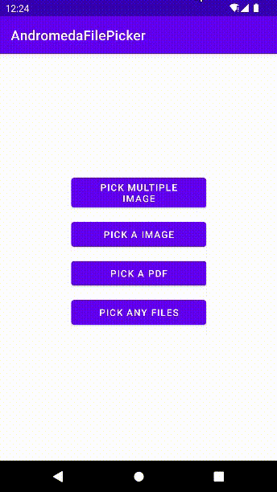

# Andromeda File Picker


[](https://jitpack.io/#Alireza-Saeedi/andromedaFilePicker)

#### file picker library for Android by by _Alireza Saeedi_



## What's new

- 🎉 Android 12 Compatibility
- 📄 Show pdf, docx, ... in Android 11,12
- 🎵 Show Music Cover
- 📌 Show Images in List
- 📌 Show APK icon in List

### Add your project

```bash
  allprojects {
		repositories {
			...
			maven { url 'https://jitpack.io' }
		}
	}
```

### Step 2. Add the dependency

```bash
  dependencies {
	        implementation 'com.github.Alireza-Saeedi:andromedaFilePicker:1.1.0'
	}
```

### Step 3. Add the manifests

```bash
 <application
       ...
        android:requestLegacyExternalStorage="true"
        >
    ...
    </application>
```

## Usage 📑

#### A- Easy Use:

```bash
new AndromedaFilePicker(this)
                .setOnResult(files -> {
                    if (files != null && files.size() > 0) {
                        List<AndromedaFile> selectedFiles = files;
                        //write your codes
                    }
                })
                .show();
```

#### B- Adcanced Use:

use filter , multiple

```bash
new AndromedaFilePicker(this)
                .multiple(true, 2)
                .withFilter(false, false, "pdf","docx")
                .setOnResult(files -> {
                    if (files != null && files.size() > 0) {
                        List<AndromedaFile> selectedFiles = files;
                        //write your codes
                    }
                })
                .show();
```

`setOnResult()` return selected files

In the table below, you can see all the methods and use them 
| methods | description |
|-----------------------|----------------------|
|multiple(`enableMultiple`, `maxItemSelected`) | select multiple file. <br>`enableMultiple` is `boolean`. for enabled this feature.<br>`maxItemSelected` is `int`. limit item selected.<br>example :`multiple(true,2)`|
|withFilter(`dirOnly`, `allowHidden`,`suffixes`) | filter files with suffixes. <br>`dirOnly` is `boolean`.<br>`allowHidden` is `boolean`. show hidden files.<br>`suffixes` is `string...`.file suffixes.<br>example :`withFilter(false, false, "pdf","png","docx","mp3")`|
|withFilterRegex(`dirOnly`, `allowHidden`,`pattern`) | filter files with regex. <br>`dirOnly` is `boolean`.<br>`allowHidden` is `boolean`. show hidden files.<br>`pattern` is `string`. regex pattern.<br>example :`withFilterRegex(false, false, ".*\\.(jpe?g|png)")`| 
|withStartPath(`startPath`) | Specifies start directory for picker. <br>`startPath` is `string`.<br> example :`withStartPath(Environment.getExternalStoragePublicDirectory(Environment.DIRECTORY_DOWNLOADS).getAbsolutePath())`|
|withHiddenFiles(`show`) | show hidden files (file name start with dot). <br>`show` is `boolean`.<br>example :`withHiddenFiles(true)`|

## Themes

you can change the following colors to suit your theme. `styles.xml:`

- file picker activity theme:

```bash
<style name="AndromedaAppTheme" parent="Theme.MaterialComponents.Light.NoActionBar">
        <item name="colorPrimary">@color/andromeda_primary_color</item>
        <item name="colorAccent">@color/andromeda_primary_color</item>
        <item name="colorPrimaryVariant">@color/andromeda_primary_color</item>
        <item name="android:statusBarColor" tools:targetApi="l">?attr/colorPrimaryVariant</item>
        <item name="colorControlHighlight">@color/andromeda_row_selector</item>
        <item name="android:windowLightStatusBar" tools:ignore="NewApi">false</item>
    </style>
```

- header textView theme:

```bash
    <style name="AndromedaHeaderTextView" parent="AndromedaAppTheme">
        <item name="android:textColor">#fff</item>
        <item name="android:textSize">15sp</item>
    </style>
```

- list Empty textView theme:

```bash
    <style name="AndromedaListEmpty" parent="AndromedaAppTheme">
        <item name="android:textColor">#858585</item>
        <item name="android:textSize">18sp</item>
        <item name="android:textStyle">bold</item>
    </style>
```

- FloatingActionButton theme:

```bash
    <style name="AndromedaFinishSelected" parent="ThemeOverlay.Material3.FloatingActionButton.Primary">
        <item name="android:clickable">true</item>
        <item name="android:backgroundTint">?attr/colorPrimary</item>
        <item name="fabSize">normal</item>
        <item name="srcCompat">@drawable/check</item>
        <item name="android:layout_marginBottom">15dp</item>
        <item name="android:layout_marginEnd">15dp</item>
        <item name="tint">#fff</item>
    </style>
```

- list item theme:

```bash
    <style name="AndromedaListItem" parent="AndromedaAppTheme">
        <item name="android:paddingLeft">14dp</item>
        <item name="android:paddingRight">14dp</item>
        <item name="android:paddingTop">8dp</item>
        <item name="android:paddingBottom">8dp</item>
        <item name="android:clickable">true</item>
        <item name="android:focusable">true</item>
        <item name="android:background">?attr/selectableItemBackground</item>
        <item name="android:gravity">center_vertical</item>
    </style>
```

- list item image theme:

```bash
    <style name="AndromedaListItemImage" parent="AndromedaAppTheme">
        <item name="android:layout_marginEnd">10dp</item>
        <item name="android:layout_width">45dp</item>
        <item name="android:layout_height">45dp</item>
    </style>
```

- list item selected image theme:

```bash
    <style name="AndromedaListItemImageSelected" parent="AndromedaAppTheme">
        <item name="android:layout_width">20dp</item>
        <item name="android:layout_height">20dp</item>
        <item name="android:src">@drawable/check_circle</item>
        <item name="android:tint">#55EC58</item>
    </style>
```

- list item file name theme:

```bash
    <style name="AndromedaListItemName" parent="AndromedaAppTheme">
        <item name="android:textColor">#222222</item>
        <item name="android:textSize">16sp</item>
        <item name="android:singleLine">true</item>
        <item name="android:ellipsize">end</item>
        <item name="android:textAlignment">viewStart</item>
        <item name="android:textDirection">locale</item>
    </style>
```

- list item file type theme:

```bash
       <style name="AndromedaListItemType" parent="AndromedaAppTheme">
        <item name="android:textColor">#454545</item>
        <item name="android:textSize">13sp</item>
        <item name="android:singleLine">true</item>
        <item name="android:ellipsize">end</item>
        <item name="android:layout_marginTop">3dp</item>
        <item name="android:textAlignment">viewStart</item>
        <item name="android:textDirection">locale</item>
    </style>
```

## Texts

You can also change the texts according to your program and language. `string.xml:`

```bash
<resources>
    <string name="deny_permission">There is no storage access permission</string>
    <string name="empty_directory">Empty Directory</string>
    <string name="choose_file">Select a file</string>
    <string name="choose_files">Select files (%d / %d)</string>
    <string name="type_archive">Archive</string>
    <string name="type_certificate">Certificate</string>
    <string name="type_directory">Directory</string>
    <string name="type_document">File</string>
    <string name="type_drawing">Picture</string>
    <string name="type_excel">Spreadsheet</string>
    <string name="type_image">Image</string>
    <string name="type_music">Music</string>
    <string name="type_video">Video</string>
    <string name="type_pdf">PDF document</string>
    <string name="type_power_point">Presentation</string>
    <string name="type_word">Document</string>
    <string name="type_apk" translatable="false">APK</string>
    <string name="type_json" translatable="false">JSON</string>
    <string name="internal_storage">Internal Storage</string>
    <string name="sd_storage">SD Card</string>
    <string name="back">go back</string>
    <string name="maxSelected">You have selected the maximum number allowed.</string>
</resources>
```
